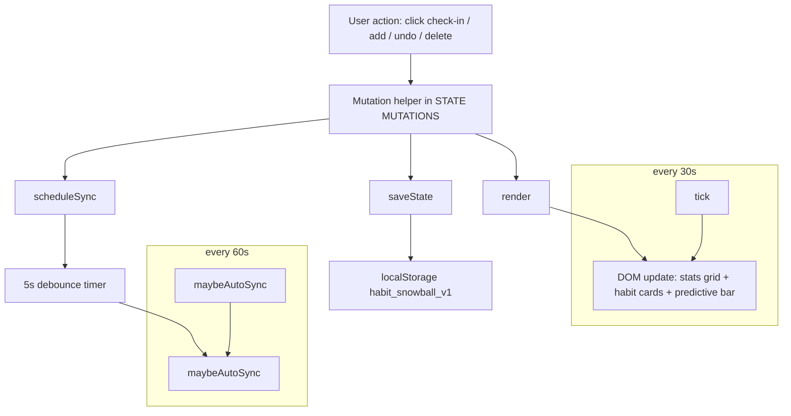
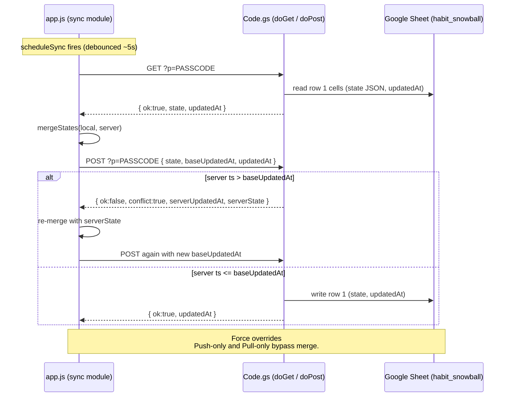

# Architecture — Habit Snowball

> Deep-read companion to `CONTEXT.md`. `CONTEXT.md` is the 30-second refresher; this file is the map you open when you actually need to change code.

## 1. Stack at a glance

A single-page habit tracker delivered as plain `index.html` + `styles.css` + one vanilla JS IIFE in `app.js`. No framework, no bundler, no build step — open `index.html` in a browser and it runs. Persistence is two-tier: `localStorage` is the source of truth on-device, and a Google Apps Script Web App (`Code.gs`) mirrors state into a Google Sheet so the same data can be used on phone and computer. Auth is a shared passcode stored in Apps Script Properties and passed as `?p=...` on every request. All UI copy is in Vietnamese.

## 2. Frontend module map

Everything lives in `d:\Sec\app.js` inside one `(() => { 'use strict'; ... })();` IIFE. The sections below are the labeled banners that already exist in the file — line numbers are stable starting points.

| Section | Line | Responsibility |
|---|---|---|
| `STORAGE` | 8 | `STORAGE_KEY` / `SYNC_CONFIG_KEY` / `SYNC_META_KEY`, `loadState()`, `saveState()`, soft-delete GC. |
| `UTILS` | 90 | `makeId()`, `clampScore()`, `dayKey()`, `sameDay()`, `diffDays()`, `slotOfHour()`, stage helpers. |
| `CORE ALGORITHMS` | 142 | `BASE_GAIN`, `computeCheckInGain()`, `computeSameDayExtraGain()`, `applyCheckIn()`, `undoLastCheckIn()`, `computeStreakFromHistory()`, `decayPerDay()`, `applyDailyDecay()`, time-of-day probability. |
| `STATE MUTATIONS` | 452 | Add/edit/delete/undo/check-in/restore helpers. Each mutation ends with `saveState(); render(); scheduleSync();`. |
| `UI` | 575 | Renders the habit cards, predictive bar, stats grid, modal templates. |
| `FREQUENCY STATS & ACTIVITY GRID` | 684 | Per-habit stats counters + 26-week activity heatmap. |
| `HELPERS` | 1024 | DOM helpers, formatters. |
| `TOAST` | 1050 | `showToast(message, isError)`. |
| `MODAL` | 1062 | Open/close wiring for the Add Habit and Sync modals. |
| `CLOCK LOOP` | 1170 | `tick()` updates the predictive bar from the current time. |
| `BOOT` | 1178 | `render()`, first `tick()`, `setInterval(tick, 30s)`, `setInterval(maybeAutoSync, 60s)`, online listener. |
| `SYNC UI WIRING` | 1542 | Buttons inside the sync modal: save config, push, pull, diff preview. |
| `HOOK SYNC INTO STATE MUTATIONS` | 1722 | `scheduleSync()` debounce + the auto-sync entrypoint (`maybeAutoSync`). |

`d:\Sec\index.html` declares the markup (header, predictive bar, stats grid, habits grid, empty state, two modals, toast) and includes `app.js?v=9` plus `styles.css?v=7` at the bottom of `<body>`. The query-string version on `styles.css` is bumped whenever visual changes ship so cached clients pick them up.

## 3. State and render flow



Key invariants:

- `state` is a single object `{ habits: Habit[] }` and is the only thing persisted under `STORAGE_KEY`.
- Every mutation follows the same shape: mutate the habit in place → `saveState()` → `render()` → `scheduleSync()`. The sync module is therefore a side-effect of state change, not the other way around.
- `render()` is idempotent — re-running it with the same state yields the same DOM. That's what makes the 30-second clock tick safe.
- `normalizeHabit()` runs in `loadState()` (storage path) and inside the merge result (sync path) so every habit coming into memory has the full field set with safe defaults.

## 4. Sync protocol



Rules in plain text:

- A single Web App URL handles both read and write. Passcode is sent as `?p=...` and checked against Script Property `SYNC_PASSCODE`.
- Sheet schema is intentionally tiny: 1 row × 3 cells `[key='state', stateJSON, updatedAt]`. Don't change it without coordinating `Code.gs` and `SYNC_SETUP.md`.
- Default sync flow is pull → merge → push (safe default that converges both sides).
- Merge rule: same `id` → keep the entry whose most-recent `history[].timestamp` is newer. Empty-history tie-breakers prefer higher score, then local. Unique IDs are unioned.
- Force overrides: "Đẩy lên cloud" pushes without merging (with a conflict warning if the server is newer); "Tải về từ cloud" overwrites local (destructive, requires confirmation).
- Soft-delete (`_deleted` + `_deletedAt`) is CRDT-safe: a delete on one device is preserved when merged with another device that never saw the habit. GC happens after 30 days in `loadState()`.

## 5. Boot sequence

```1178:1192:d:\Sec\app.js
  /* ---------------- BOOT ---------------- */
  render();
  tick();
  setInterval(tick, 30000); // update predictive bar every 30s
  // Auto-sync in background every 60s (best-effort, only when configured + online).
  setInterval(() => { maybeAutoSync(); }, 60000);
  window.addEventListener('online', () => { maybeAutoSync(true); });
```

What happens in order:

1. `render()` — reads `state` from `localStorage` (via `loadState()`) and draws the entire DOM.
2. `tick()` — sets the predictive bar's clock/slot text for the current minute.
3. `setInterval(tick, 30s)` — keeps the predictive bar fresh without rebuilding the whole grid.
4. `setInterval(maybeAutoSync, 60s)` — best-effort background sync; only does work if a sync config exists and the browser is online.
5. `window.addEventListener('online', ...)` — fires `maybeAutoSync(true)` when the browser transitions from offline to online.

## 6. Where to add things

Quick checklist mapped to the existing rules in `.cursorrules`:

- **New habit field** — add the field with a safe default in `normalizeHabit()` (line ~51). Mirror it in `DEFAULT_STATE` if the top-level shape changes. If it's sync-relevant, also update the read/write paths in `Code.gs` (no schema change needed as long as it lives inside the JSON blob).
- **New mutation** — drop a helper into `STATE MUTATIONS` (line ~452) and end it with `saveState(); render(); scheduleSync();`. Never mutate `state.habits` from a UI handler directly.
- **New UI section** — markup in `d:\Sec\index.html` (modals, sections), render in the `UI` section, style with BEM-ish class names (`.habit-card`, `.stat-card`, `.btn-primary`, `.btn-ghost`). If the change is visually meaningful, bump `styles.css?v=N` in `index.html` so cached clients refetch.
- **New sync behavior** — extend the sync module at the bottom of `app.js` (lines 1542+). If the user-visible flow changes, mirror the description in `SYNC_SETUP.md` in the same change.
- **New admin tool** — add a function in `Code.gs`'s admin helpers block (after `unbindSheet`). These are run manually from the Apps Script editor, not exposed over HTTP.

## 7. Known gotchas

- **`dayKey()` is un-padded.** It produces `2026-9-5`, not `2026-09-05`. Every comparison, merge, and decay reference relies on this exact format. Don't "fix" it to ISO without a migration; sync will break across devices.
- **`makeId()` format matters for sync.** It returns `'h_' + base36 random + base36 timestamp`. The `h_` prefix is what makes IDs recognizably human in the JSON. Don't switch to `Date.now()` alone or `crypto.randomUUID()` without auditing the merge code — sync merge keys on `id` collision, not format.
- **Soft-delete is multi-device safe.** Setting `_deleted: true` and `_deletedAt: <ms>` on one device propagates through `mergeStates` so the other device sees the delete too. Hard deletes don't survive a sync round-trip until the 30-day GC in `loadState()`.
- **`state` is late-bound inside the IIFE.** The sync module's `scheduleSync()` and `maybeAutoSync()` read `state` from closure, so `state = loadState()` must be reached before any mutation fires. Don't move the initial assignment earlier or split it into multiple files without re-checking the closure.
- **CSS cache busting is manual.** When you ship visual changes, bump `styles.css?v=N` in `index.html` (currently `?v=7`). Forgetting it will leave users on the old look until they hard-reload.
- **Passcode is shared-secret only.** It's stored in plain text in `localStorage` and in Script Properties. Don't add a login UI on top of it.
- **Web App URL and passcode never go in the repo.** Each user's URL + passcode live only in their own `localStorage` (key `habit_snowball_sync_v1`).

## 8. Cross-links

- `CONTEXT.md` — 30-second refresher (data model, run instructions, quick-edit checklist). Open this first.
- `.cursorrules` — agent conventions (Vietnamese copy, ID format, sheet layout, what to avoid). The authoritative coding style.
- `SYNC_SETUP.md` — Vietnamese step-by-step for end users setting up the Google Sheets backend.
- `Code.gs` admin helpers — `setPasscode(p)`, `clearPasscode()`, `resetData()`, `bindSheet(urlOrId)`, `unbindSheet()`, `printSheetId()`. Run from the Apps Script editor.
- `index.html` — DOM structure for modals, stats grid, habits grid, toast.
- `styles.css` — visual design (BEM-ish class names).
